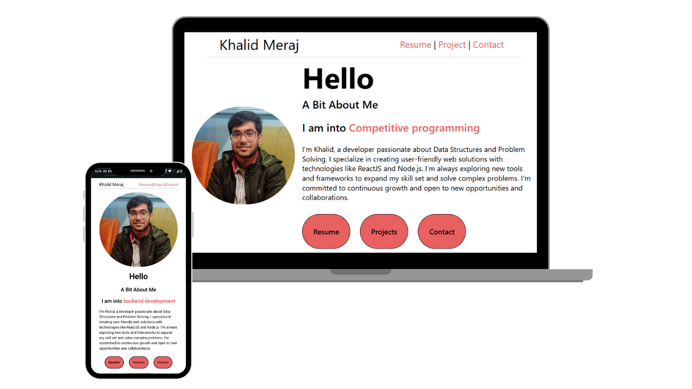
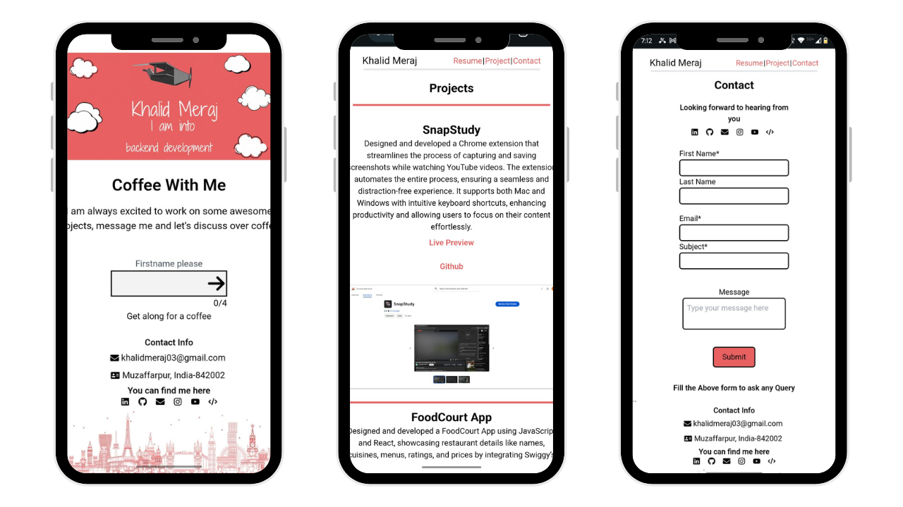

<h2 align="center">
  Portfolio Website 
  <a href="https://portfolio-xi-lemon-62.vercel.app/" target="_blank">Khalid Meraj</a>
</h2>

  
  

 

 &nbsp;
 &nbsp;

<h3 align="center">
    🔹
    <a href="https://github.com/Khaliditsme/Portfolio/issues">Report Bug</a> &nbsp; &nbsp;
    🔹
    <a href="https://github.com/Khaliditsme/Portfolio/issues">Request Feature</a>
</h3>

## TL;DR
Feel free to fork this repository to customize and make it your own. If you use this project, I kindly request that you provide proper credit by linking back to [Khalid Meraj](https://github.com/Khaliditsme/Portfolio/) Portfolio. Your support is greatly appreciated!

## Built With

My personal portfolio <a href="https://portfolio-xi-lemon-62.vercel.app/" target="_blank">Khalid Meraj</a> which features some of my github projects as well as my resume and technical skills. 

This project was built using these technologies.

- React.js
- Node.js
- Express.js
- TailwindCss
- VsCode
- Vercel
- Render
- Webpack

## Features

**📖 Multi-Page Layout**

**🎨 Styled with React and TailwindCss with easy to customize colors**

**📱 Fully Responsive**

## Getting Started

Clone down this repository. You will need `node.js` and `git` installed globally on your machine.

## 🛠 Installation and Setup Instructions

1. Installation: `npm install`

2. In the project directory, you can run: `npm start`

Runs the app in the development mode.\
Open [http://localhost:3000](http://localhost:3000) to view it in the browser.
The page will reload if you make edits.

## Usage Instructions

Open the project folder and Navigate to `/src/components/`.  
You will find all the components used and you can edit your information accordingly.

### Show your support

Give a ⭐ if you like this website!
